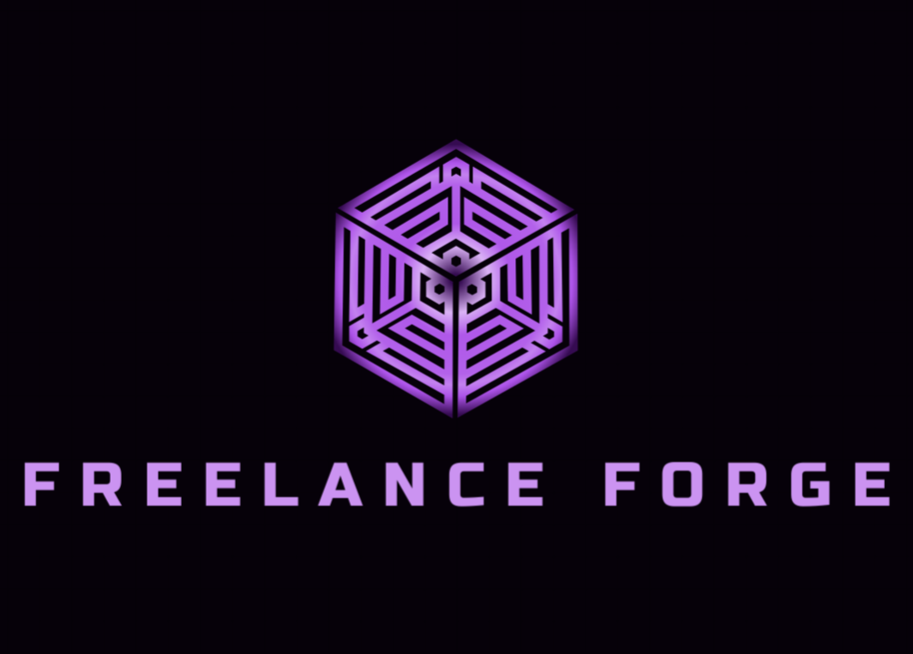

  

<h4 style="text-align:center;" align="center">Freelance Forge is a decentralized platform that provides an escrow service to manage payments and project milestones between clients and freelancers. The platform ensures transparency, trust, and security through the use of smart contracts on the Ethereum blockchain.</h4>

## What it Does

Freelance Forge facilitates seamless project management by allowing clients and freelancers to:
- **Create Binding Agreements**: Establish a clear and secure escrow contract with predefined terms and conditions.
- **Escrow and Fund Management**: Clients can stake funds securely in an escrow contract, ensuring payment only upon successful completion of milestones.
- **Milestone-Based Payments**: The project is divided into milestones, with payments released as each milestone is completed.
- **Dispute Resolution**: In case of disagreements, the contract can be canceled, with funds returned according to the terms of the agreement.

## How it Works

Freelance Forge comprises two core smart contracts:

### 1. **FreelanceAgreement.sol**
   - **State Management**: Tracks the project status from initiation to completion or cancellation.
   - **Staking Mechanism**: Ensures the client stakes the agreed project price, which is held securely until project completion.
   - **Milestone Payments**: Divides the project into milestones, with each milestone linked to a specific payment.
   - **Cancellation and Refunds**: Either party can cancel the agreement, triggering different refund scenarios based on the project’s progress.

### 2. **FreelanceAgreementFactory.sol**
   - **Contract Deployment**: Deploys new `FreelanceAgreement` contracts for each project, allowing for multiple, independent agreements on the platform.
   - **Management of Agreements**: Stores and tracks all deployed agreements, providing an overview of all active contracts for both clients and freelancers.

## How We Built It

Freelance Forge leverages Solidity smart contracts to ensure trustless and transparent interactions between clients and freelancers. The platform’s architecture consists of the following components:
- **FreelanceAgreement**: Handles individual project agreements, managing the lifecycle of the project, including state transitions, staking, milestone payments, and potential cancellations.
- **FreelanceAgreementFactory**: Manages the deployment of new agreements, ensuring each client-freelancer project is isolated within its own contract.

### Key Features
- **Secure Escrow**: Funds are securely held in the contract until project milestones are completed.
- **Transparent Project Management**: Both parties can track the progress of the project and funds at any time.
- **Automated Payments**: Payments are automatically released upon the successful completion of milestones.
- **Dispute Handling**: Built-in mechanisms to handle cancellations and disputes, ensuring fairness for both parties.

## Challenges We Faced

Developing Freelance Forge came with its own set of challenges:
- **Complex State Management**: Managing the lifecycle of projects and ensuring that state transitions were secure and transparent required careful design and testing.
- **Staking Mechanism**: Ensuring that the staking and refund mechanisms worked flawlessly to prevent any fund mismanagement.
- **Scalability**: Designing the platform to handle multiple agreements simultaneously while maintaining efficiency and security.

## Accomplishments

We are proud of the following milestones:
- **Robust Smart Contracts**: Developed secure and efficient smart contracts to manage the lifecycle of freelance projects.
- **User-Centric Design**: Ensured that the platform is easy to use, with transparent operations that build trust between clients and freelancers.
- **Scalability**: Successfully implemented a factory pattern to manage multiple freelance agreements, allowing the platform to scale effectively.

## What We Learned

Through the development of Freelance Forge, we gained insights into:
- **Advanced Solidity Concepts**: Implementing complex state machines and handling financial transactions securely.
- **Factory Design Pattern**: Efficiently deploying and managing multiple instances of smart contracts.
- **User Trust**: Building a platform that prioritizes transparency and fairness to foster trust between parties in a decentralized environment.

## Future Developments

In future iterations, we plan to:
- **Integrate Dispute Resolution**: Implement advanced dispute resolution mechanisms to handle more complex disagreements between parties.
- **Expand Payment Options**: Allow payments in various cryptocurrencies to increase platform flexibility.
- **Enhance UI/UX**: Develop an intuitive front-end interface to simplify interaction with the platform.

## Conclusion

Freelance Forge is a pioneering platform that leverages blockchain technology to create a secure, transparent, and efficient environment for freelance work. By automating key processes and ensuring trustless interactions, Freelance Forge sets a new standard for freelance project management.

---

